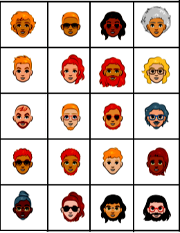
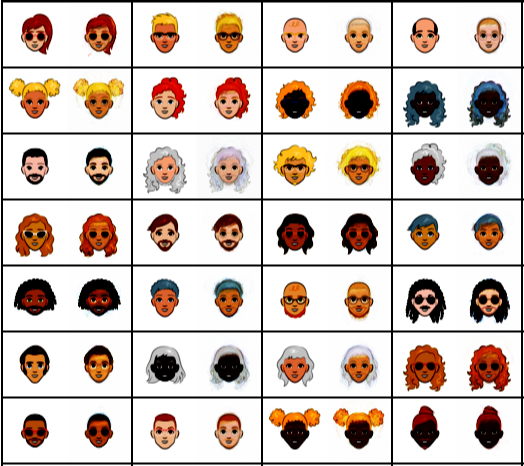
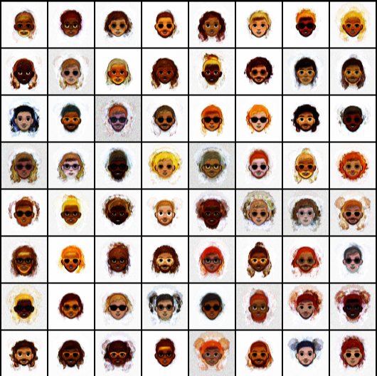

# Cartoon-Character-Generation-with-VAE

## Cartoon character faces dataset 

I use https://google.github.io/cartoonset/ as the dataset.
The dataset contains 10000 face images. 
All the images are with size of 500 * 500. 

+ data

## Reconstruction

+ reconstruction

## Generation

+ samples

